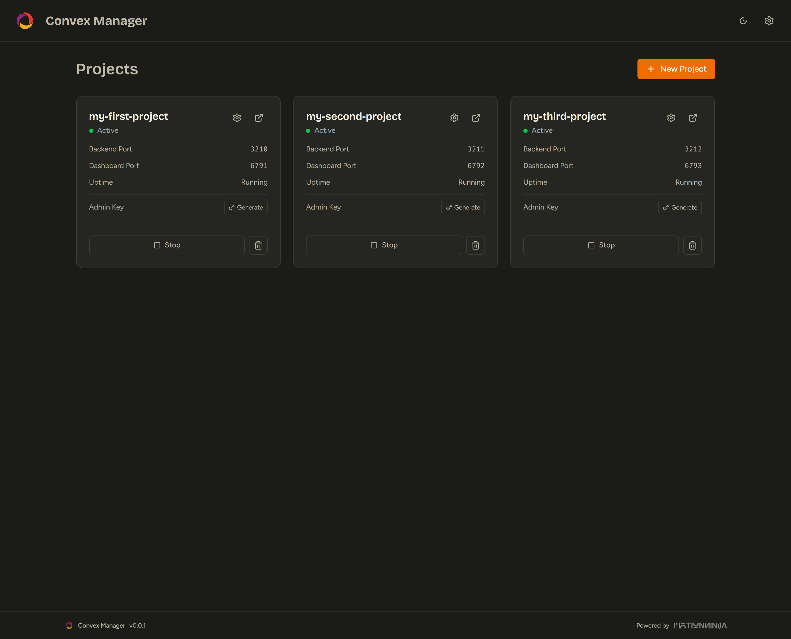
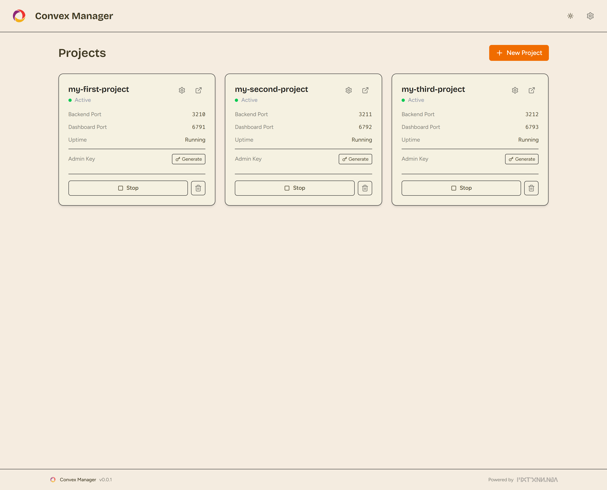
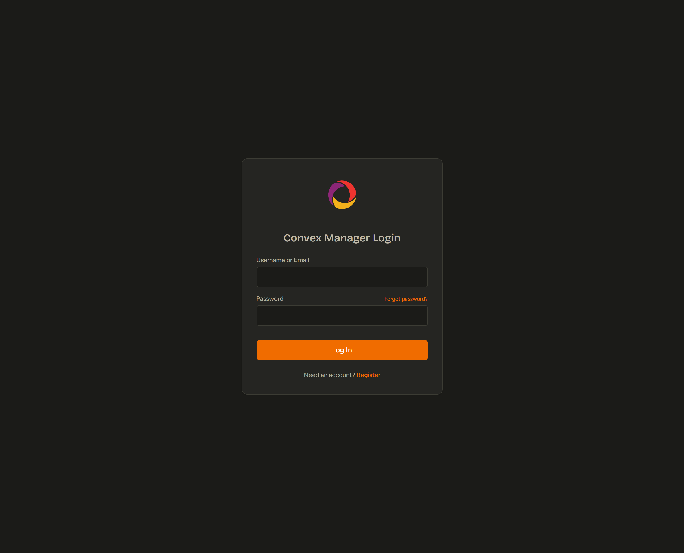
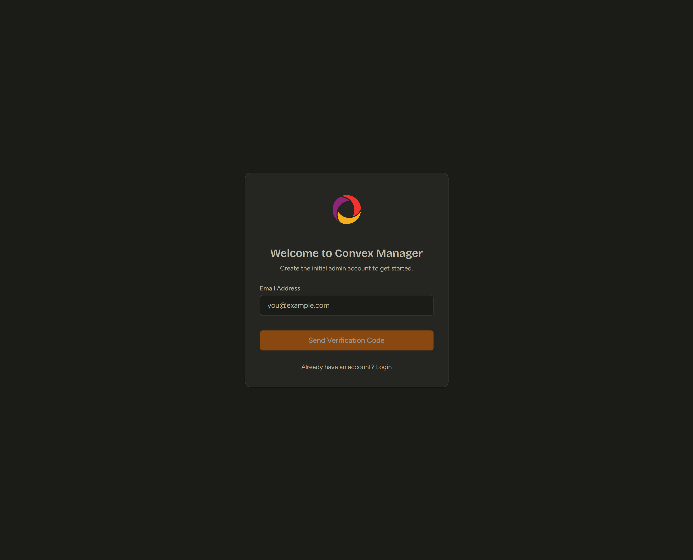
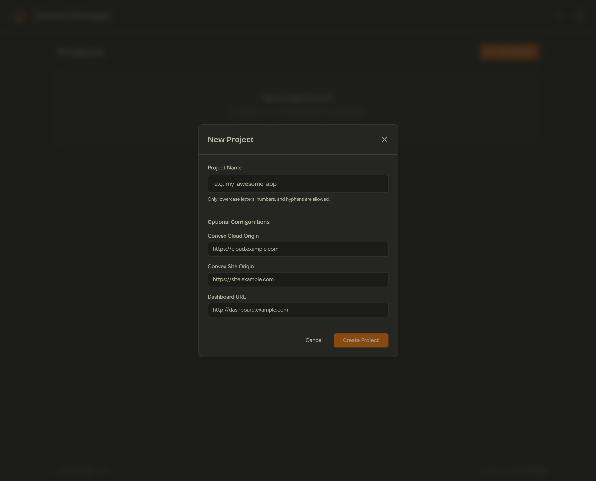
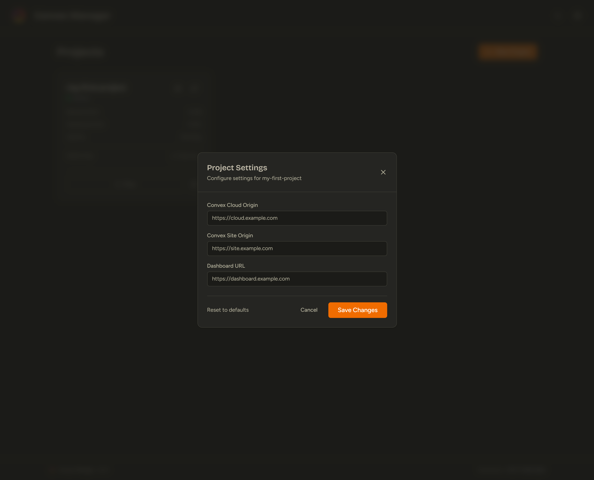

# Convex Manager

A self-hosted project manager for [Convex](https://convex.dev/). This tool allows you to spin up multiple local Convex instances using Docker Compose, each with its own backend, dashboard, and database.

<p align="center">
  
  <br>
  
</p>

## Features

- **Project Management**: Create, start, stop, and delete isolated Convex instances.
- **Role-Based Access Control**: Admin and User roles with invite-based or open registration.
- **Port Management**: Automatically assigns unique ports for each project's backend, site, and dashboard.
- **Dashboard Integration**: One-click access to the Convex Dashboard for each instance.
- **Real-time Status**: Live status updates and log streaming.
- **Configuration Overrides**: Customize Convex instance environment variables (e.g., Auth, Auth0, Clerk integration).

## Screenshots

<details>
<summary>Click to view more screenshots</summary>

### Authentication

<p align="center">
  
  
</p>

### Creating Projects

<p align="center">
  
</p>

### Project Settings & Configuration

<p align="center">
  
</p>

</details>

## Architecture

- **Backend**: Node.js + Express + PostgreSQL. Handles Docker Compose commands (`up`, `down`, `logs`) via `child_process` and stores user/project data.
- **Frontend**: React + Vite + TailwindCSS + shadcn/ui.
- **Data Persistence**: Project configurations are stored in the PostgreSQL database and synced to the local filesystem (`projects/` directory). Convex instance data is persisted using Docker named volumes.

***

## 🛠️ Local Development

To run the application locally for development and contribution:

### Prerequisites

- **Node.js** (v18+)
- **Docker** and **Docker Compose** running on your machine.
- **PostgreSQL** (Optional: A Docker compose file is provided to spin up a local DB).

### Setup Steps

1. **Clone the repository**:
   ```bash
   git clone https://github.com/mamaspacetlau/convex-manager.git
   cd convex-manager
   ```
2. **Install Dependencies**:
   This command installs dependencies for the root, backend, and frontend concurrently.
   ```bash
   npm run install:all
   ```
3. **Start the Database (Optional but recommended)**:
   If you don't have a local PostgreSQL instance running, you can start the provided dev database:
   ```bash
   docker compose up manager-db -d
   ```
4. **Environment Variables**:
   In the `backend` directory, create a `.env` file based on `.env.example` (or use defaults if running the local dev DB):
   ```env
   # backend/.env
   PORT=3001
   DB_HOST=localhost
   DB_PORT=5433  # 5433 if using the provided docker-compose db, 5432 if local
   DB_USER=postgres
   DB_PASSWORD=convex_manager_secret
   DB_NAME=convex_manager_db
   JWT_SECRET=your_super_secret_key_here
   ALLOW_REGISTRATION=true
   ```
5. **Start the Application**:
   Run both the backend and frontend concurrently:
   ```bash
   npm start
   ```
   - **Backend API**: `http://localhost:3001`
   - **Frontend UI**: `http://localhost:5173`
6. **First Login**:
   - Open `http://localhost:5173` in your browser.
   - Since the database is empty, the first user to register will automatically become the **Admin**.

***

## 🐳 Docker Deployment (Production)

For deploying Convex Manager on a server (e.g., VPS, EC2, Raspberry Pi):

### Prerequisites

- **Docker** and **Docker Compose** installed on your server.

### Quick Start with Pre-built Images

We provide pre-built Docker images hosted on Docker Hub. This is the fastest way to get up and running.

1. **Download the configuration**:
   Create a directory for your Convex Manager and download the production compose file:
   ```bash
   mkdir convex-manager && cd convex-manager
   curl -O https://raw.githubusercontent.com/mamaspacetlau/convex-manager/main/docker-compose.prod.yml
   ```
2. **Configure Environment (Optional)**:
   By default, the compose file uses secure defaults. To customize (e.g., setting a custom JWT secret or Email SMTP settings), create an `.env` file in the same directory:
   ```env
   JWT_SECRET=generate_a_random_secure_string
   ALLOW_REGISTRATION=false
   APP_URL=http://your-server-ip:8080
   # SMTP Settings for email invites/resets
   SMTP_HOST=smtp.yourprovider.com
   SMTP_PORT=587
   SMTP_USER=your_email@domain.com
   SMTP_PASS=your_email_password
   EMAIL_FROM="Convex Manager" <noreply@domain.com>
   ```
3. **Start the Stack**:
   Rename the file to `docker-compose.yml` or specify it directly:
   ```bash
   docker compose -f docker-compose.prod.yml up -d
   ```
4. **Access the Manager**:
   Navigate to `http://<your-server-ip>:8080` in your browser.
   - *Note: It may take a few seconds for the database to initialize on the first run.*

### Managing the Stack

- **View Logs**: `docker compose logs -f`
- **Stop**: `docker compose down`
- **Update to latest version**:
  ```bash
  docker compose pull
  docker compose up -d
  ```

***

## 🏗️ Building from Source (Docker)

If you prefer to build the Docker images yourself locally:

1. Clone the repository.
2. Build and start the stack:
   ```bash
   docker compose up -d --build
   ```

## Security Considerations

- **Docker Socket**: The `manager-backend` container requires access to `/var/run/docker.sock` to spin up Convex instances. Ensure your host server is secure.
- **Exposed Ports**: Convex Manager dynamically allocates ports starting from `3210`, `3310`, and `6791`. If you have a firewall (like UFW), ensure these port ranges are open if you intend to access individual Convex projects from external machines.
- **Admin Keys**: Project Admin Keys are stored in the database. Protect your database credentials.

## License

MIT
