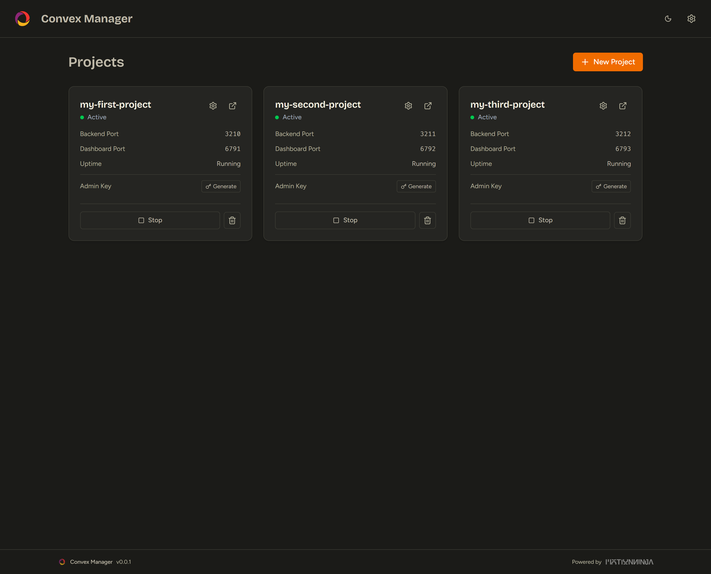
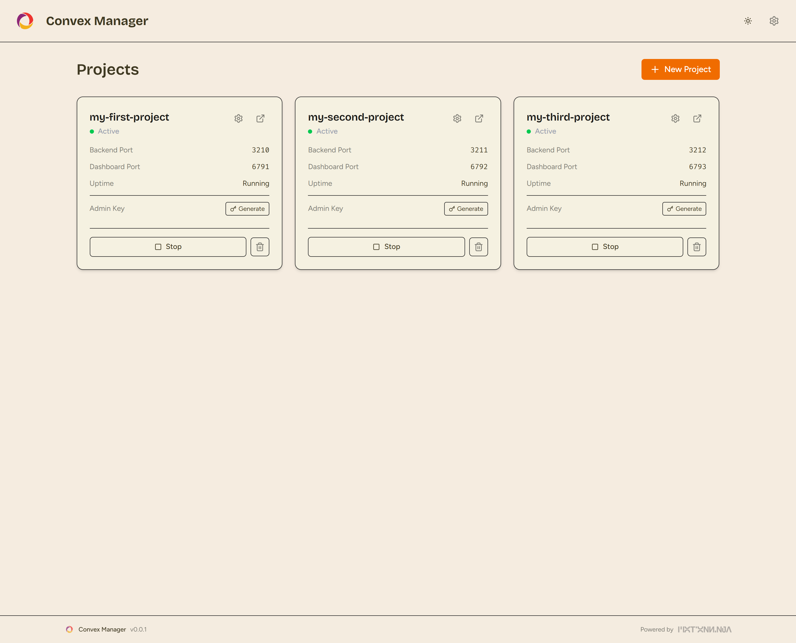
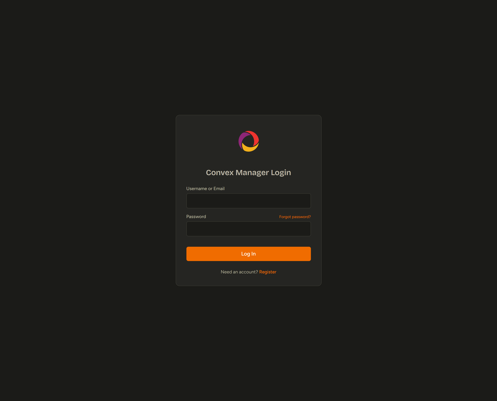
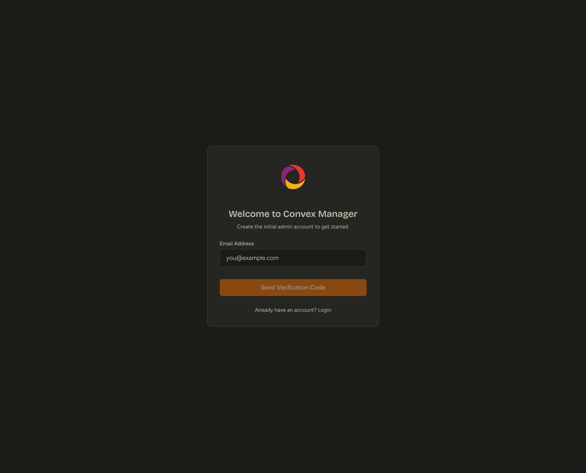
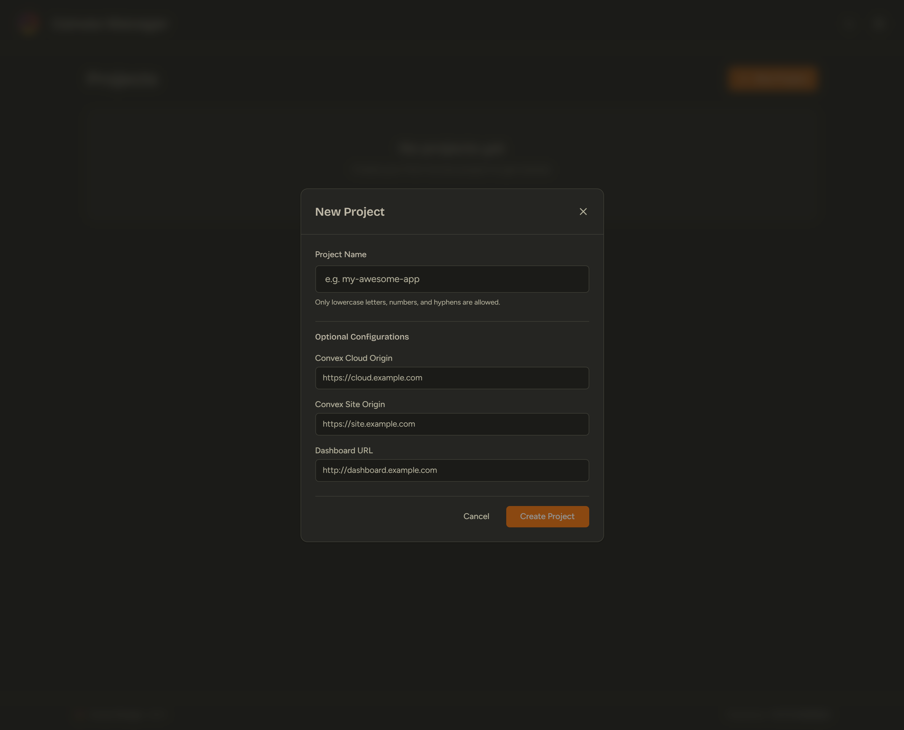
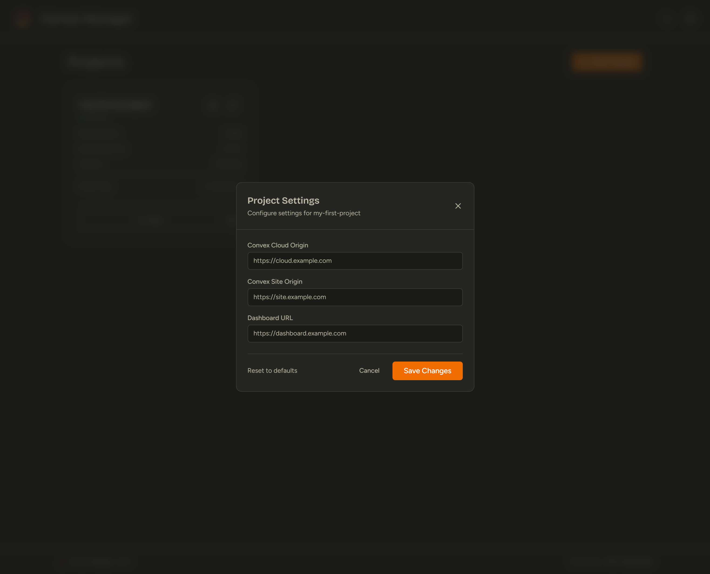

# Convex Manager

A self-hosted project manager for [Convex](https://convex.dev/). This tool allows you to spin up multiple local Convex instances using Docker Compose, each with its own backend, dashboard, and database.

<p align="center">
  
  <br>
  
</p>

## Features

- **Project Management**: Create, start, stop, and delete isolated Convex instances.
- **Role-Based Access Control**: Admin and User roles with invite-based or open registration.
- **Port Management**: Automatically assigns unique ports for each project's backend, site, and dashboard.
- **Dashboard Integration**: One-click access to the Convex Dashboard for each instance.
- **Real-time Status**: Live status updates and log streaming.
- **Configuration Overrides**: Customize Convex instance environment variables (e.g., Auth, Auth0, Clerk integration).
- **Reverse Proxy Support**: Expose projects on your own domains through [Traefik](#using-a-reverse-proxy-traefik) or [Pangolin](#using-pangolin).

## Screenshots

<details>
<summary>Click to view more screenshots</summary>

### Authentication

<p align="center">
  
  
</p>

### Creating Projects

<p align="center">
  
</p>

### Project Settings & Configuration

<p align="center">
  
</p>

</details>

## Architecture

- **Backend**: Node.js + Express + PostgreSQL. Handles Docker Compose commands (`up`, `down`, `logs`) via `child_process` and stores user/project data.
- **Frontend**: React + Vite + TailwindCSS + shadcn/ui.
- **Data Persistence**: Project configurations are stored in the PostgreSQL database and synced to the local filesystem (`projects/` directory). Convex instance data is persisted using Docker named volumes.

***

## 🛠️ Local Development

To run the application locally for development and contribution:

### Prerequisites

- **Node.js** (v18+)
- **Docker** and **Docker Compose** running on your machine.
- **PostgreSQL** (Optional: A Docker compose file is provided to spin up a local DB).

### Setup Steps

1. **Clone the repository**:
   ```bash
   git clone https://github.com/mamaspacetlau/convex-manager.git
   cd convex-manager
   ```
2. **Install Dependencies**:
   This command installs dependencies for the root, backend, and frontend concurrently.
   ```bash
   npm run install:all
   ```
3. **Start the Database (Optional but recommended)**:
   If you don't have a local PostgreSQL instance running, you can start the provided dev database:
   ```bash
   docker compose up manager-db -d
   ```
4. **Environment Variables**:
   In the `backend` directory, create a `.env` file based on `.env.example` (or use defaults if running the local dev DB):
   ```env
   # backend/.env
   PORT=3001
   DB_HOST=localhost
   DB_PORT=5433  # 5433 if using the provided docker-compose db, 5432 if local
   DB_USER=postgres
   DB_PASSWORD=convex_manager_secret
   DB_NAME=convex_manager_db
   JWT_SECRET=your_super_secret_key_here
   ALLOW_REGISTRATION=true
   ```
5. **Start the Application**:
   Run both the backend and frontend concurrently:
   ```bash
   npm start
   ```
   - **Backend API**: `http://localhost:3001`
   - **Frontend UI**: `http://localhost:5173`
6. **First Login**:
   - Open `http://localhost:5173` in your browser.
   - Since the database is empty, the first user to register will automatically become the **Admin**.

***

## 🐳 Docker Deployment (Production)

For deploying Convex Manager on a server (e.g., VPS, EC2, Raspberry Pi):

### Prerequisites

- **Docker** and **Docker Compose** installed on your server.

### Quick Start with Pre-built Images

We provide pre-built Docker images hosted on Docker Hub. This is the fastest way to get up and running.

1. **Download the configuration**:
   Create a directory for your Convex Manager and download the production compose file:
   ```bash
   mkdir convex-manager && cd convex-manager
   curl -O https://raw.githubusercontent.com/mamaspacetlau/convex-manager/main/docker-compose.prod.yml
   ```
2. **Configure Environment (Optional)**:
   By default, the compose file uses secure defaults. To customize (e.g., setting a custom JWT secret or Email SMTP settings), create an `.env` file in the same directory:
   ```env
   JWT_SECRET=generate_a_random_secure_string
   ALLOW_REGISTRATION=false
   APP_URL=http://your-server-ip:8080
   # SMTP Settings for email invites/resets
   SMTP_HOST=smtp.yourprovider.com
   SMTP_PORT=587
   SMTP_USER=your_email@domain.com
   SMTP_PASS=your_email_password
   EMAIL_FROM="Convex Manager" <noreply@domain.com>
   ```
3. **Start the Stack**:
   Rename the file to `docker-compose.yml` or specify it directly:
   ```bash
   docker compose -f docker-compose.prod.yml up -d
   ```
4. **Access the Manager**:
   Navigate to `http://<your-server-ip>:8080` in your browser. 
   - *Note: It may take a few seconds for the database to initialize on the first run.*

### Using a Reverse Proxy (Traefik)

If you already have Traefik running on your VPS, you can easily expose Convex Manager by adding labels to the `manager-frontend` service in your `docker-compose.prod.yml`:

```yaml
  manager-frontend:
    image: motionninja/convex-manager-frontend:latest
    container_name: convex-manager-frontend
    # Remove the 'ports' section if using Traefik
    labels:
      - "traefik.enable=true"
      - "traefik.http.routers.convex-manager.rule=Host(`manager.yourdomain.com`)"
      - "traefik.http.routers.convex-manager.entrypoints=websecure"
      - "traefik.http.routers.convex-manager.tls.certresolver=myresolver" # Change to your resolver name
      - "traefik.http.services.convex-manager.loadbalancer.server.port=80"
    networks:
      - convex-manager
      - traefik_proxy # Your external Traefik network
```
*Don't forget to declare the external `traefik_proxy` network at the bottom of the compose file if you use this method.*

#### Exposing Individual Convex Projects via Traefik

Convex Manager allows you to dynamically generate Traefik routing labels for the individual Convex instances you create. 

When creating or editing a project in the Convex Manager UI, add the following keys to the **Configuration Overrides** JSON:

```json
{
  "traefik_enabled": "true",
  "traefik_network": "traefik_proxy",
  "traefik_certresolver": "myresolver",
  "traefik_backend_rule": "api.myproject.yourdomain.com",
  "traefik_site_rule": "site.myproject.yourdomain.com",
  "traefik_dashboard_rule": "dashboard.myproject.yourdomain.com"
}
```
*Note: You only need to provide the raw domain names. The backend automatically wraps them in `Host()` rules. You do not need to provide all three rules. Only the services you specify a rule for will be exposed via Traefik.*

### Using Pangolin

If you run [Pangolin](https://pangolin.net/) (self-hosted) on the same server, use `docker-compose.pangolin.yml`. Everything joins Pangolin's `pangolin` Docker network, so **no host ports are published**: Pangolin reaches the manager and every Convex project by container name.

The manager creates each project's Pangolin resources for you through the Pangolin Integration API. This works with any site type, including the **local** site of a self-hosted install.

#### 1. Enable the Pangolin Integration API

The Integration API is off by default on self-hosted Pangolin. In Pangolin's `config/config.yml`, add (or extend your existing `flags:` section):

```yaml
flags:
  enable_integration_api: true
```

Then restart Pangolin:

```bash
docker compose restart pangolin
```

You do **not** need to expose the API publicly. The manager calls it directly over the Docker network at `http://pangolin:3003`.

#### 2. Create an API key and collect your IDs

In the Pangolin dashboard:

| Value | Where to find it |
|---|---|
| **API key** | Organization → **API Keys** → create a key with blueprint and resource permissions. Copy the full key (`<id>.<secret>`). |
| **Org ID** | The first path segment of the dashboard URL: `https://pangolin.yourdomain.com/<orgId>/...` |
| **Site identifier** | Organization → **Sites** → the site that can reach the manager's containers (usually the **local** site on the same server). Use its **Identifier** (e.g. `thirsty-calamaria-gervaisii`), not its display name, domain, or numeric ID. |

#### 3. Configure and start Convex Manager

```bash
git clone https://github.com/mamaspacetlau/convex-manager.git
cd convex-manager
cp .env.example .env
```

Add to `.env` (alongside `JWT_SECRET`, SMTP settings, etc.):

```env
APP_URL=https://manager.yourdomain.com

PANGOLIN_API_URL=http://pangolin:3003   # Pangolin container name + integration port; no /v1
PANGOLIN_API_KEY=<id>.<secret>
PANGOLIN_ORG_ID=<orgId>
PANGOLIN_SITE=<site identifier>
```

Start the stack:

```bash
docker compose -f docker-compose.pangolin.yml up -d
```

*The compose file expects the external `pangolin` network created by the Pangolin installer. Check with `docker network ls | grep pangolin`.*

#### 4. Verify the connection

This checks the API, key, org and site in one request. It should print JSON with `"success":true`:

```bash
KEY=$(grep '^PANGOLIN_API_KEY=' .env | cut -d= -f2)
docker exec convex-manager-backend wget -qO- \
  --header "Authorization: Bearer $KEY" \
  "http://pangolin:3003/v1/org/<orgId>/site/<site identifier>"
```

| Result | Meaning |
|---|---|
| `bad address 'pangolin'` | The manager isn't on the same Docker network as Pangolin, or the container has a different name. |
| Connection refused | `enable_integration_api` is not active. Check `config.yml` and restart Pangolin. |
| `401` / `403` | The API key is wrong or missing permissions. |
| `404` | Wrong org ID or site identifier. List your sites with `.../v1/org/<orgId>/sites`. |

#### 5. Expose the manager itself

In the Pangolin dashboard, create an HTTP resource for the manager UI (for example `manager.yourdomain.com`) on your site, targeting `convex-manager-frontend` port `80`.

#### 6. Expose Convex projects

When creating a project (or later in **Project Settings**), enable **Pangolin Reverse Proxy** and enter the domains you want:

| Field | Pangolin resource | Target |
|---|---|---|
| Backend Domain | `<project> (Convex backend)` | `backend-<project>:3210` |
| Site Domain | `<project> (Convex site)` | `backend-<project>:3211` |
| Dashboard Domain | `<project> (Convex dashboard)` | `dashboard-<project>:6791` |

- Only the domains you fill in become resources, and the Convex origin URLs are set to `https://<domain>` automatically.
- Backend and site resources are always public, because Convex clients and HTTP actions must reach them. Tick **Protect dashboard with Pangolin SSO** to put the dashboard behind Pangolin login.
- Domains must be under a base domain configured in Pangolin, and must be unique per project (e.g. `myproject-api.yourdomain.com`, not a shared `api.yourdomain.com`).

The manager keeps Pangolin in sync:

- **Create project**: resources are created.
- **Save settings**: resources are updated. Clearing a domain or disabling Pangolin deletes the matching resource.
- **Delete project**: its resources are deleted.

If a sync fails, the project action still completes, the UI shows a `Pangolin sync failed` alert, and details are logged:

```bash
docker logs convex-manager-backend 2>&1 | grep Pangolin
```

A successful sync logs `[Pangolin] <project>: applied [...]`.

#### Alternative: container labels (Newt sites)

If you leave the `PANGOLIN_API_*` variables empty, the manager instead adds Pangolin blueprint labels (`pangolin.public-resources.*`) to each project's containers. These are only read by a **Newt** site that has Docker socket access and shares the `pangolin` network:

```yaml
    # in your Newt service
    volumes:
      - /var/run/docker.sock:/var/run/docker.sock:ro
    environment:
      - DOCKER_SOCKET=/var/run/docker.sock
```

Local sites ignore labels, so a Pangolin **404 page not found** on a project domain usually means the labels were never picked up. Use the Integration API instead.

#### Configuration reference

| Variable | Default | Description |
|---|---|---|
| `PANGOLIN_API_URL` | *(empty)* | Pangolin Integration API base URL, without `/v1`. |
| `PANGOLIN_API_KEY` | *(empty)* | Integration API key (`<id>.<secret>`). |
| `PANGOLIN_ORG_ID` | *(empty)* | Pangolin organization ID. |
| `PANGOLIN_SITE` | *(empty)* | Identifier of the site whose targets reach the project containers. |
| `PROJECTS_NETWORK` | `convex-manager` | Docker network that project containers join. Set to `pangolin` in `docker-compose.pangolin.yml`. |

The API is used only when all four `PANGOLIN_*` variables are set.

### Managing the Stack

- **View Logs**: `docker compose logs -f`
- **Stop**: `docker compose down`
- **Update to latest version**:
  ```bash
  docker compose pull
  docker compose up -d
  ```

***

## 🏗️ Building from Source (Docker)

If you prefer to build the Docker images yourself locally:

1. Clone the repository.
2. Build and start the stack:
   ```bash
   docker compose up -d --build
   ```

## Security Considerations

- **Docker Socket**: The `manager-backend` container requires access to `/var/run/docker.sock` to spin up Convex instances. Ensure your host server is secure.
- **Exposed Ports**: Convex Manager dynamically allocates ports starting from `3210`, `3310`, and `6791`. If you have a firewall (like UFW), ensure these port ranges are open if you intend to access individual Convex projects from external machines.
- **Admin Keys**: Project Admin Keys are stored in the database. Protect your database credentials.

## License

MIT
